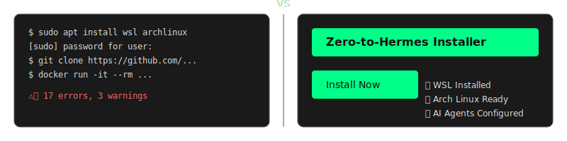
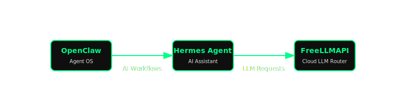
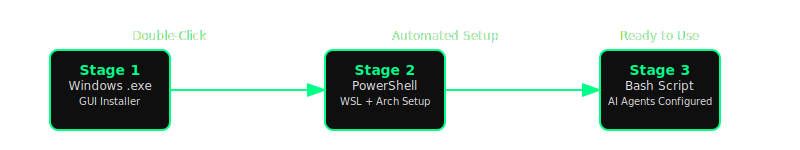

# Zero-to-Hermes: AI Agent Setup How-To

*One-click installer for OpenClaw, Hermes (the swift AI agent), and FreeLLMAPI on Windows.*
*Zero to Hermes: from no AI agent to having your own Hermes-powered agent team in minutes.*

---

## Welcome to the AI Revolution, Made Easy

The **Zero-to-Hermes** project is designed to break down the technical barriers to accessing cutting-edge AI. We believe that powerful tools like AI agents should be available to everyone, regardless of their technical background. This installer provides a streamlined, zero-friction path to setting up your own personal AI ecosystem, empowering you to explore, learn, and build with the latest open-source technologies.

---

## Features That Empower You
✅ **True Zero-Knowledge Installation**: No terminal, no Linux, no Docker experience required. Just double-click the installer and follow the visual prompts.
✅ **Automated WSL + Arch Linux Setup**: Seamlessly installs the Windows Subsystem for Linux and an optimized Arch Linux environment, ready for AI workloads.
✅ **Always on the Bleeding Edge**: Built on Arch Linux's rolling release model, ensuring you always have the most up-to-date versions of your AI tools as soon as they're available.
✅ **Self-Documenting & Educational**: Every step of the process is explained, turning installation into a learning opportunity.
✅ **Comprehensive Toolset**: Installs OpenClaw, Hermes Agent, and FreeLLMAPI, providing a full suite for AI interaction, automation, and cloud LLM aggregation.
✅ **Paperclip-powered Agent Teams**: Get your own organization (team) of AI agents via Paperclip that you can orchestrate to tackle complex tasks, with Hermes as the intelligent worker agent doing the actual reasoning, coding, and creative work.

---

## Our Philosophy: Serious About Accessibility

We adhere to the principle that "matters of little concern should be treated seriously." This means:
*   **Respecting Your Time**: A user-friendly graphical installer (GUI) isn't just a convenience; it's a fundamental respect for your time and learning curve.
*   **Strategic Edge**: Choosing Arch Linux isn't reckless; it's a strategic decision to keep you aligned with the rapid pace of AI innovation.
*   **Empowering Self-Sufficiency**: While providing shortcuts, we also aim to explain the underlying processes, enabling you to understand and eventually master your AI environment.

---

## The AI Ecosystem You'll Control

This installer sets up three core components that work together to give you a powerful, personal AI assistant ecosystem:

- **OpenClaw**: **your personal assistant** – the operating system for your AI agents, providing the foundation and tools to build, manage, and orchestrate AI workflows.
- **Paperclip**: **your organisation of AI agents** – a framework that lets you create, organise, and manage teams of AI agents to tackle complex tasks.
- **Hermes**: **the AI agent that Paperclip uses for the actual work** – the intelligent assistant that performs the reasoning, coding, analysis, and creative tasks assigned by your Paperclip agent organisation.
- **FreeLLMAPI**: **used by both Hermes and OpenClaw for free API credits** – an aggregation service that intelligently routes your AI requests to various cloud LLM providers, optimising for free-tier usage and diverse model access.

Together, these tools give you a complete, locally-controlled environment where you can harness the power of AI agents without needing deep infrastructure expertise.

---

## Ethical AI & Security: A Responsible Approach

We recognize that powerful AI tools come with significant responsibilities. This project is built with an awareness of the dual-use nature of AI. We emphasize:
*   **Responsible Use**: Understanding AI's potential for misuse (e.g., in propaganda, cyberattacks) and practicing critical evaluation of AI outputs.
*   **Local Control (for parts of your workflow)**: While FreeLLMAPI leverages cloud services, the overall setup provides you with a robust local environment for your agents, enhancing privacy and control over your AI interactions.
*   **Verifiable Knowledge**: Promoting critical thinking and verification of AI-generated information.
*   **Community Vigilance**: Fostering an open-source community where safety and ethical considerations are paramount.

---

## How It Works: The Three-Stage Bootstrap

Our installer uses a robust three-stage process to seamlessly set up your environment:

1.  **Windows Executable (.exe)**: The initial, user-friendly graphical installer (built with Inno Setup) handles core Windows dependencies like Windows Terminal and Docker Desktop. It manages necessary system restarts.
2.  **PowerShell Script (Stage 2)**: This script, launched by the .exe, sets up WSL (Windows Subsystem for Linux) and installs the Arch Linux distribution, preparing the Linux environment for your AI tools.
3.  **Bash Script (Stage 3 - inside WSL)**: The final stage, executed within Arch Linux, clones and configures OpenClaw, Hermes Agent, and FreeLLMAPI, launching all services in the background.

---

## Documentation
| 
   -   **[Paperclip Service (docs/paperclip-service.md)](docs/paperclip-service.md)**: Instructions to run Paperclip as a systemd service.
   |
|

## Feedback & Contributions

We welcome your feedback, suggestions, and contributions!
-   **Found a bug or have a feature idea?** Please open an [issue](https://github.com/s-k-y-h-i-g-h/AI-agent-setup-howto/issues).
-   **Want to contribute?** See our [GitHub Ecosystem Workflow Guide](docs/github-workflow.md) for how to get involved.

---

> **Hermes Agent** — Your steadfast collaborator in the AI revolution.
> *Built with care for the Sovereign Republic of Antarctica and its Co-Monarchs.*
